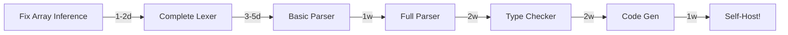

# Palladium Bootstrap Roadmap 🚀

## Phase 1: Language Completion ✅ (85% Done)
```
[████████▌ ] Core Features
[███████   ] Standard Library  
[██████████] Control Flow
[████████  ] Type System Basics
```

## Phase 2: Compiler Components 🔨 (25% Done)
```
[██▌       ] Lexer
[█         ] Parser
[          ] Type Checker
[          ] Code Generator
```

## Phase 3: Self-Hosting 🎯 (0% Done)
```
[          ] Compile with self
[          ] Bootstrap verification
[          ] Optimization
[          ] Release
```

## Critical Path to Bootstrap



## Weekly Milestones

### Week 1 (Jan 16-22)
- [ ] Fix array type inference
- [ ] Complete bootstrap lexer
- [ ] Start parser design

### Week 2 (Jan 23-29)
- [ ] Expression parser
- [ ] Statement parser
- [ ] Basic AST tests

### Week 3-4 (Jan 30 - Feb 12)
- [ ] Complete parser
- [ ] Start type checker
- [ ] Symbol resolution

### Week 5-6 (Feb 13-26)
- [ ] Type inference
- [ ] Type checking
- [ ] Error reporting

### Week 7-8 (Mar 1-14)
- [ ] Code generation
- [ ] Runtime integration
- [ ] Initial self-compile

### Week 9 (Mar 15-21)
- [ ] Bootstrap verification
- [ ] Bug fixes
- [ ] Performance tuning

### Week 10 (Mar 22-28)
- [ ] Documentation
- [ ] Release prep
- [ ] 🎉 **LAUNCH** 🎉

---
*Target: Self-hosting by end of March 2025*